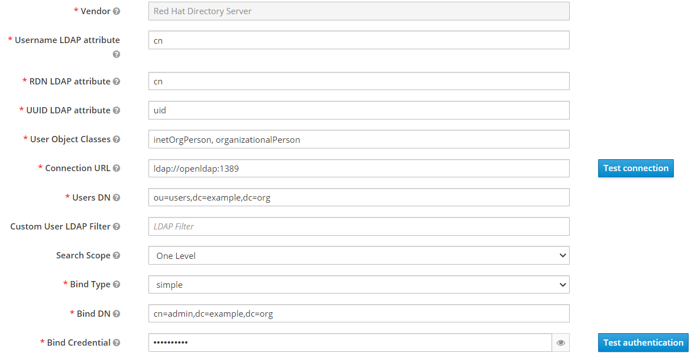
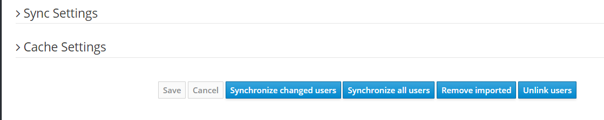

= Kafka Keycloak Demo

Demonstration on how to configure Kafka authentication and authorization using OAuth2.

== Products Version

[options="header"]
|=======================
| Product               | Version
| OpenShift             | 4.9
| AMQ Streams Operator  | amqstreams.v2.0.1-2
| RH-SSO Operator       | rhsso-operator.7.5.1-opr-010
| Quarkus               | 2.7.5.Final
|=======================

== Requirements on your workstation

* Access to an OpenShift 4.9 cluster
* Maven
* Java 11 JDK
* Ansible >= 2.9
* Python module for kubernetes and openshift
* oc client

== Installing The Demo Using Ansible

=== Parameters

[options="header"]
|=======================
| Parameter | Example Value                                      | Definition
| token     | sha256~vFanQbthlPKfsaldJT3bdLXIyEkd7ypO_XPygY1DNtQ | access token for a user with cluster-admin privileges
| server    | https://api.mycluster.opentlc.com:6443             | OpenShift cluster API URL
|=======================

=== Running the playbook

The first step to do the installation is to run the playbook. This playbook is responsible for the AMQ Streams and RH-SSO installation,
plus the environment configuration required for the applications to work. To run the playbook just declare *token* and *server* as environment variables.
You may take this from the OpenShift `Copy login command` page.

    token=REPLACE_ME
    server=REPLACE_ME
    ansible-playbook -e token=${token} -e server=${server} playbook.yml

=== Deploying the applications

After the environment configuration with the playbook, you may install the applications, `processor` and `producer` using the following maven command:

    oc project kafka-keycloak
    mvn clean package -Dquarkus.kubernetes.deploy=true

== Testing the applications

This demo is a very simple producer/consumer example. The `producer` app exposes a REST API to allow you to request a `quote`, the results are streamed through a HTTP GET
call in the same API. The `processor` app will take those requests in the background from a topic and provide a quote in another topic.

To demonstrate this, open two terminal. In the first one, add the streamed responses:

    export ROUTE=$(oc get route kafka-producer -o jsonpath='{.spec.host}' -n kafka-keycloak)
    curl http://$ROUTE/quotes

In the second one, you may send multiple requests like this:

    export ROUTE=$(oc get route kafka-producer -o jsonpath='{.spec.host}' -n kafka-keycloak)
    curl -X POST http://$ROUTE/quotes/request

== Testing user logon with admin tasks

=== Run kafka client on your terminal

  oc run -ti --restart=Never --image=registry.redhat.io/amq7/amq-streams-kafka-30-rhel8:2.0.1 kafka-client -n kafka-keycloak -- /bin/sh

=== Set the certificates

on the kafka-client terminal:

    SSO_HOST=REPLACE_ME
    SSO_HOST_PORT=$SSO_HOST:443
    STOREPASS=storepass
    KAFKA_HOST_PORT=my-cluster-kafka-bootstrap:9093
    echo "Q" | openssl s_client -showcerts -connect $SSO_HOST_PORT 2>/dev/null | awk '/BEGIN CERTIFICATE/,/END CERTIFICATE/ { print $0 } ' > /tmp/sso.crt
    keytool -keystore /tmp/truststore.p12 -storetype pkcs12 -alias sso -storepass $STOREPASS -import -file /tmp/sso.crt -noprompt
    echo "Q" | openssl s_client -showcerts -connect $KAFKA_HOST_PORT 2>/dev/null | awk '/BEGIN CERTIFICATE/,/END CERTIFICATE/ { print $0 } ' > /tmp/my-cluster-kafka.crt
    keytool -keystore /tmp/truststore.p12 -storetype pkcs12 -alias my-cluster-kafka -storepass $STOREPASS -import -file /tmp/my-cluster-kafka.crt -noprompt

=== Get a token

You need to authenticate on Keycloak before trying to access Kafka.

    USERNAME=alice
    PASSWORD=alice-password
    GRANT_RESPONSE=$(curl -X POST "https://$SSO_HOST/auth/realms/kafka-authz/protocol/openid-connect/token" -H 'Content-Type: application/x-www-form-urlencoded' -d "grant_type=password&username=$USERNAME&password=$PASSWORD&client_id=kafka-cli&scope=offline_access" -s -k)
    REFRESH_TOKEN=$(echo $GRANT_RESPONSE | awk -F "refresh_token\":\"" '{printf $2}' | awk -F "\"" '{printf $1}')

=== Set the access properties

Create the file with all the information required to access Kafka.

    cat > /tmp/alice.properties << EOF
    security.protocol=SASL_SSL
    ssl.truststore.location=/tmp/truststore.p12
    ssl.truststore.password=$STOREPASS
    ssl.truststore.type=PKCS12
    sasl.mechanism=OAUTHBEARER
    sasl.jaas.config=org.apache.kafka.common.security.oauthbearer.OAuthBearerLoginModule required \
    oauth.refresh.token="$REFRESH_TOKEN" \
    oauth.client.id="kafka-cli" \
    oauth.ssl.truststore.location="/tmp/truststore.p12" \
    oauth.ssl.truststore.password="$STOREPASS" \
    oauth.ssl.truststore.type="PKCS12" \
    oauth.token.endpoint.uri="https://$SSO_HOST/auth/realms/kafka-authz/protocol/openid-connect/token" ;
    sasl.login.callback.handler.class=io.strimzi.kafka.oauth.client.JaasClientOauthLoginCallbackHandler
    EOF

=== Testing your access

Once you have your properties file set, you may test your permission in the following ways:

Creating a topic:

      bin/kafka-topics.sh --bootstrap-server my-cluster-kafka-bootstrap:9093 --command-config /tmp/alice.properties --topic x_messages --create --replication-factor 1 --partitions 1

Listing available topics:

      bin/kafka-topics.sh --bootstrap-server my-cluster-kafka-bootstrap:9093 --command-config /tmp/alice.properties --list

== User federation with LDAP

You can add more users to the groups and roles used in the demo. A LDAP server is provisioned during the installation. Check the link:https://hub.docker.com/r/bitnami/openldap/[image documentation, window="_blank"] for information about passwords and default data.

The first step is to add a new User Federation LDAP provider. Here is what you should input in the form:

The password is `adminpassword`.
Once you are done, hit save. Go back to the provider configuration. In the end of the page, hit `synchronize all user`.

Expect two users to be imported.

You will be able to authenticate with those users but remember to add them to `Groups` or `Roles` so they can have access to Kafka resources.
